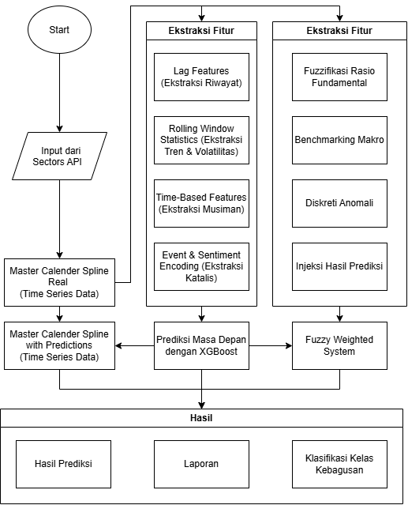

## Prerequisites
Ini khusus bagian development metode, model AI, dan Flask diawal
*   **Python:** `3.10.0` (Recommended: **3.10**, **3.11**)
*   **Package Manager:** `pip`

```bash
pip install -r requirements.txt
```

## Pipeline



## Format latih
# Base variabel sektor
date (Index),	symbol (Index),	target_volume_T_plus_1 (Y),	volume_hari_ini,	MA_90_hari_volume,	volatilitas_90_hari,	sentimen_bert_makro,	total_berita_sektor	, idx_transport_return,	is_mudik_id.

# Base variabel 1 Bisnis
date (Index),	symbol (Index),	target_volume_T_plus_1 (Y),	volume_hari_ini,	MA_90_hari_volume,	volatilitas_90_hari,	sentimen_bert_spesifik,	total_berita_spesifik, is_dividend,	is_mudik_id.


## Lokasi Model

https://drive.google.com/drive/folders/1q6NxtH5zROvEvAEWO0ihy320rxWmSiUn?usp=sharing