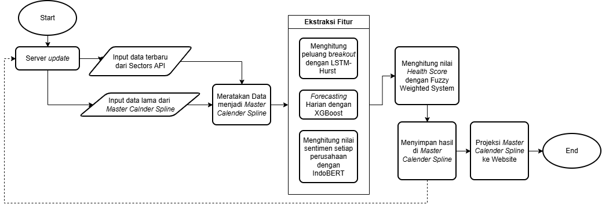

# Prerequisites
Ini khusus bagian development metode, model AI
*   **Python:** `3.11` (Recommended: **3.11.9**)
*   **Package Manager:** `pip`

# Introduction
Mikir Sekali is a website to help Investors and business owners decide their strategy when they don’t have much information on Market Intelligence.

Pitching Deck: https://canva.link/ndw3ggxcxwre0fj

# Pipeline


# How to run?

## Preparation 
1. Install all requirements
```bash
pip install -r requirements.txt
```
2. Input the API Key

Create an environment file with the name "**.env**"  and input your sectors API 
```
SECTORS_API_KEY=[API KEY]
```
You can get your sectors API from https://sectors.app/api

3. Pull the data by running
```
python code/scrapping/data_scrapping.py
```
Note* : Keep in mind that the you can use `fix_daily.py` to run if theres any error or fails on getting the data.

Note** : You can add as many target as you want based on the data that is provided by Sectors.

4. Prepare the data
```
cd code/pipeline
python pipeline.py prepare
```
This will create the data used for the model training

5. Start training the components
```
python train_xgboost_transfer.py
python lstm_hurst_train.py  
```
6. Create the main data for the website
```
python pipeline.py score
```

## Server
Make sure you are in in the **code/** directory. Then run,
```
python website/server.py
```
You can then access the website through the link in the terminal output.

To test the BERT sentiment on the website,
```
python website/sentiment_trigger.py  
```


